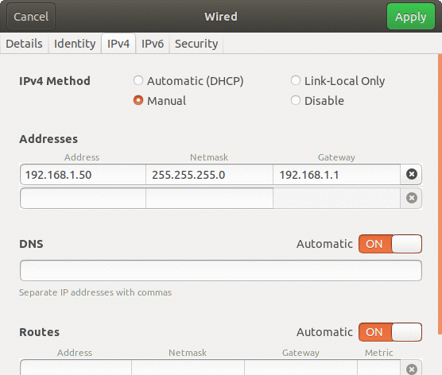

# whill_support

2つのPCを同じwifiに接続する。

## livox を接続するPC側

### **1.** コード導入
```sh
git clone https://github.com/keita1523/whill_support.git
cd whill_support
rosdep install -y --from-paths src --ignore-src --rosdistro $ROS_DISTRO
colcon build
```
### **2.** 有線LAN接続(USB変換アダプタを使用する。直接接続は起動実績なし)
以下設定例。詳細はlivoxのマニュアルを参照。  
 

### **3.** パラメータ調整方法
/src/livox_ros2_driver/launch/livox_lidar_whill_launch.pyを環境に合わせて以下の値を変更する。  
変更後再度colcon buildを行う。
| パラメータ | 説明|
| ---- | ---- |
| publish_freq | 点群publish周期 |
| enable_filtering | フィルタリング及びダウンサンプリングを有効にするかの判定 |
| filter_range_min | x方向での範囲フィルタリング最小距離 |
| filter_range_max | x方向での範囲フィルタリング最大距離 |
| downsample_ratio | ダウンサンプリング倍率(0~1) 点群が安定しない場合は小さくする。　|


### **4.** 起動
```sh
source ~/whill_support/install/setup.bash 
ros2 launch livox_ros2_driver livox_lidar_whill_launch.py
```

### **5.** 終了方法
Ctrl+Cだけではlivox_ros2_driverノードが死なない  
ps aux | grep ros2 でros2_deamonと書かれた行のプロセス番号を把握し  
kill その数字  

## Autowareを実行する側


### **1.** コード導入

```sh
git clone https://github.com/keita1523/autoware.git -b whill-develop whill_autoware
```
autoware.reposを開き、  universe/autoware.universe:のversionを**whill-develop**から**whill-develop-livox**に修正する。  
以降の導入手順はWHILL車両構築_報告書.pdfを参照。

### **2.** 点群変換ノード起動
```sh
source ~/whill_autoware/install/setup.bash
ros2 run livox_pointcloud livox_cloud_node
```
autoware及びss systemを起動する。方法はSS_自動停止システム_報告書.pdfを参照。

### **3.** livox_frame調整
以下を送信するとrviz上にlivoxから取得した点群が表示される。値を0から変更して再送信すると、位置や向きを調整できるのでmapの点群に合わせる。
```sh
ros2 run tf2_ros static_transform_publisher --x 0 --y 0 --z 0 --pitch 0 --roll 0 --yaw 0 --frame-id livox_frame --child-frame-id map
```


### **※** 注意
環境によってはautowareのビルド時に以下のエラーが発生する。  
その場合はtf2_autoware_auto_msgs.hppのPoint32とPolygonのinline void doTransform関数を削除してから再ビルドする。
```sh
undefined reference to `void tf2::doTransform<geometry_msgs::msg::Polygon_<std::allocator<void> > >(geometry_msgs::msg::Polygon_<std::allocator<void> > const&, geometry_msgs::msg::Polygon_<std::allocator<void> >&, geometry_msgs::msg::TransformStamped_<std::allocator<void> > const&)'
```
